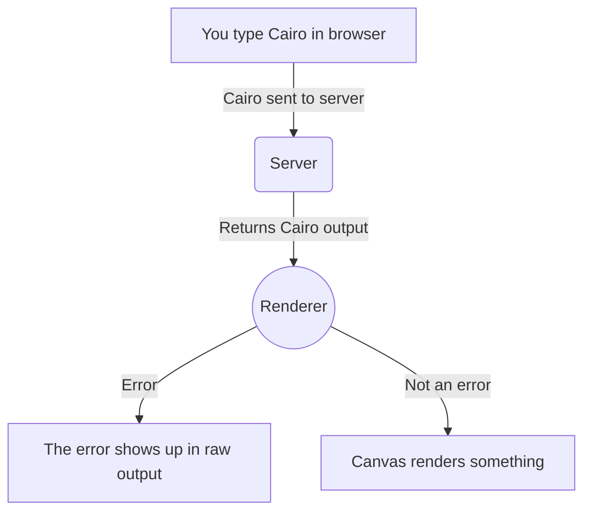

#### Creative coding with Cairo

# Creative Cairo

## How to play with it?

1. Clone the repo
2. Do `cargo run cairo-rest-server`
3. Go to [localhost:8080](http://localhost:8080/index.html) to have a play!

## What can I do with it?

Right now you can draw arcs or circles. The initial spec was to just do circles which is like hello world for a graphics thing.

For now the canvas is 512px high and wide.

### `arc`

Draws an `arc` between `start` and `end` angles.

- `x`: `felt` Center X coord
- `y`: `felt` Center Y coord
- `r`: `felt` Radius
- `start`: `felt` Angle to start at, 10000 = 2PI radians
- `end`: `felt` Angle to stop at, 10000 = 2PI radians

### `circle`

Just draws an `arc` starting at 0 and ending at 10000 (2 PI)

- `x`: `felt` Center X coordinate
- `y`: `felt` Center Y coord
- `r`: `felt` Radius

`struct Arc` describes the data type for an arc.
